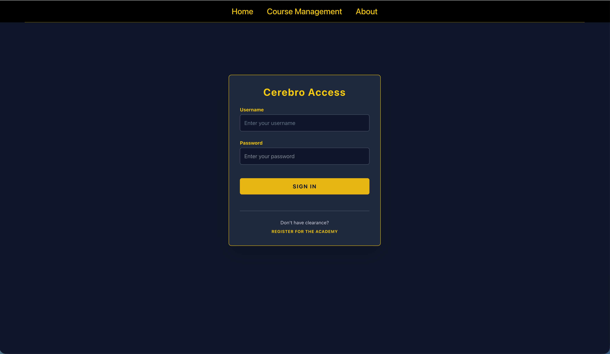
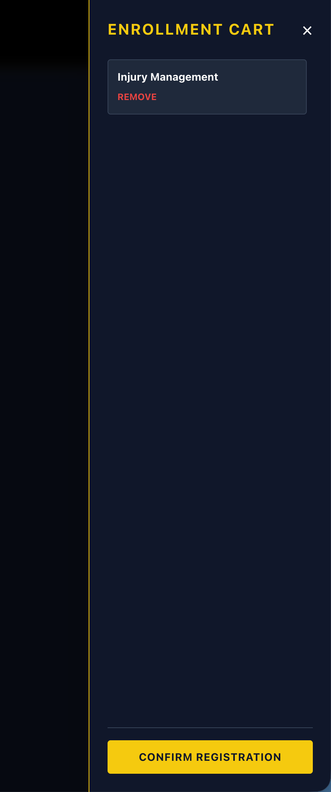
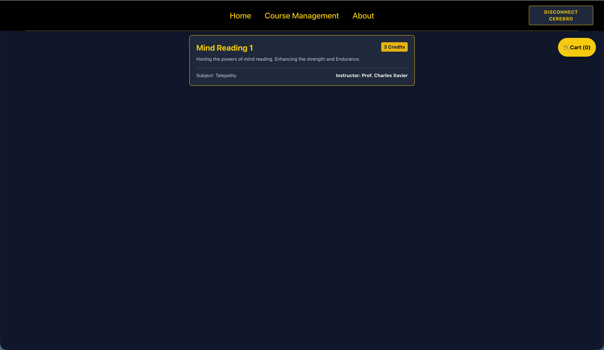

# Error 404: Course Management Platform 🎓
A robust, full-stack course management system built for the SDEV 255 final project. This platform enables seamless course enrollment, student tracking, and administrative management for the "Xavier’s School for Gifted Youngsters" platform.

## 🛠️ Tech Stack
This project leverages a modern, typesafe stack designed for scalability and data integrity:

* **Framework**: [Next.js](https://nextjs.org/) (App Router) for server-side rendering and optimized routing.
* **Styling**: [Tailwind CSS](https://tailwindcss.com/) for responsive, utility-first design.
* **Database & ORM**: [Prisma](https://www.prisma.io/) with PostgreSQL, utilizing complex schemas for Users, Courses, and Enrollments.
* **Authentication**: Custom authentication flow with secure session management.
* **Language**: [TypeScript](https://www.typescriptlang.org/) for end-to-end type safety.

## 📸 Project Showcase

### 1. Secure Authentication
The platform features a dedicated login and signup portal to manage different user roles securely.

### 2. Student Enrollment Workflow
Students can browse available courses and begin the enrollment process through an intuitive interface.

### 3. Shopping Cart System
A specialized `ShoppingCart` component manages course selections, allowing students to review their academic choices before finalizing enrollment.

### 4. Enrollment Confirmation
Once a student is successfully added to a course, the system updates the enrollment status in the database.

### 5. Administrative Controls
Faculty and administrators have access to specialized forms to add or update course information dynamically.

## 🚀 Key Features
* **Prisma Migrations**: Robust database versioning including cascade deletes and enrollment status tracking.
* **Typesafe Actions**: Server actions for handling authentication and course data manipulation securely.
* **Global Styling**: A centralized design system using `globals.css` and the custom "Wolverine" font for a unique aesthetic.

## ⚙️ Development Setup
1. Clone the repository.
2. Install dependencies: `npm install`.
3. Set up your `.env` file with database credentials.
4. Run Prisma migrations: `npx prisma migrate dev`.
5. Start the development server: `npm run dev`.